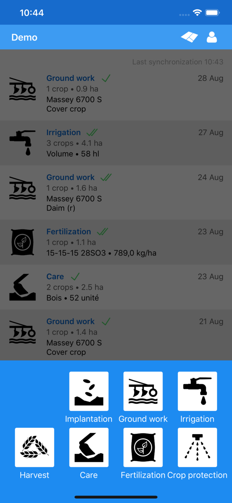
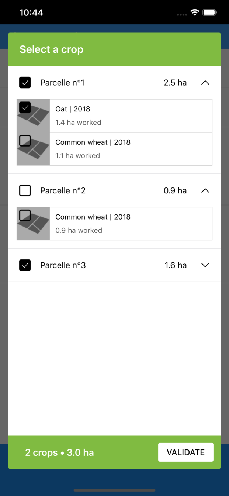
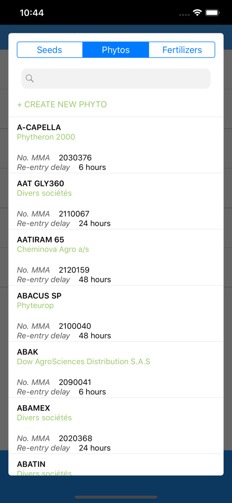
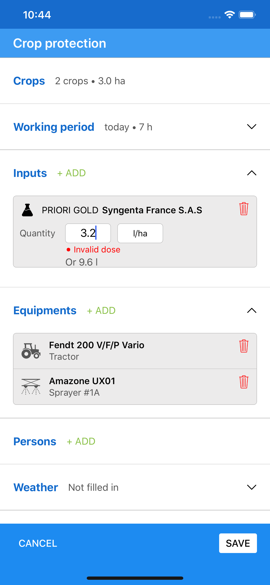

# Clic&Farm for iOS

Download on the [App Store](https://itunes.apple.com/us/app/clic-farm/id1445541915).

## Installation

### Node environment

Install nodenv to manage node environment :
```bash
brew install nodenv
```

Add nodenv to your `$PATH` :
```bash
echo 'export PATH="$HOME/.nodenv/bin:$PATH"' >> ~/.bash_profile
```

Then, install latest node LTS (recommended for Apollo GraphQL) :
```bash
nodenv install
```

To get started, you will need to install carthage (`brew install carthage`), then run these instructions:

1. `git clone git@github.com:ekylibre/zero-ios-v3.git`
1. `cd zero-ios-v3`
1. Create `oauthInfo.plist` file in `Resources` group, add login informations to this file
1. `carthage update`
1. `open Clic\&Farm-iOS.xcodeproj/`

## Sreenshots

<p align="center">
  
  
  
  
  
  
  
  
  
</p>
